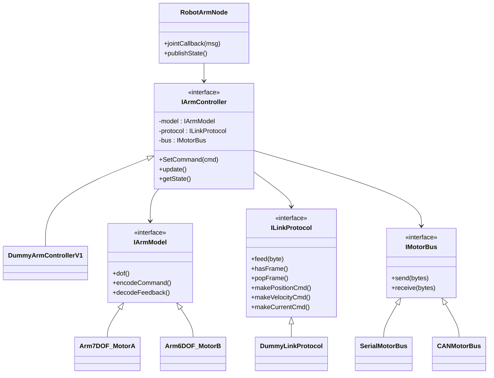

# arm_platform

> 一个 **面向真实机械臂硬件** 的 ROS 2 控制平台框架

`arm_platform` 是一个 **分层清晰、强解耦、可扩展** 的机械臂硬件控制框架，
 用于连接 **ROS 2 / MoveIt** 与 **真实电机、通讯协议和机械结构**。

该项目不是 Demo，而是面向 **工程落地** 的架构设计。

------

## 🎯 设计目标

- 支持 **不同机械臂结构**
- 支持 **不同电机类型**
- 支持 **不同通信协议（串口 / CAN / UDP）**
- 控制算法 **不依赖 ROS**
- 硬件更换 **不影响上层逻辑**
- 方便接入 MoveIt / Servo / 自定义控制器

一句话：

> **把「机械臂 / 电机 / 协议 / ROS」彻底解耦**

------

## 🧱 整体架构



------

## 📦 目录结构

```
arm_platform/
├── include/arm_platform/
│   ├── controller/        # 控制器接口与实现
│   ├── arm_model/         # 机械臂模型
│   ├── protocol/          # 通信协议
│   ├── bus/               # 物理通信总线
│   └── arm_hardware_node.h
│
├── src/
│   ├── controller/
│   ├── protocol/
│   ├── bus/
│   ├── arm_hardware_node.cpp
│   └── moveit_bridge_node.cpp
│
├── CMakeLists.txt
└── README.md
```

------

## 🧠 核心模块说明

### 1️⃣ 机械臂模型（`IArmModel`）

描述 **机械结构本身**，与电机和通信无关。

职责：

- 关节数量（DOF）
- 机械结构参数
- 运动学 / 动力学（可选）

```
class IArmModel {
public:
    virtual size_t Dof() const = 0;
};
```

示例：

- `DummyArm`
- 未来可接 KDL / Pinocchio

------

### 2️⃣ 控制器（`IArmController`）

系统的 **核心大脑**。

职责：

- 接收关节级控制指令（JointCommand）
- 生成电机级控制输出
- 更新关节状态（JointState）

```
virtual void SetCommand(const JointCommand& cmd) = 0;
virtual void Update(JointState& state) = 0;
```

支持的控制类型：

- 位置控制
- 速度控制
- MIT 力矩控制
- 零重力 / 阻抗控制

------

### 3️⃣ 通信协议（`ILinkProtocol`）

定义 **数据如何被打包 / 解包**。

职责：

- JointCommand → 字节流
- 字节流 → JointState
- 屏蔽协议差异

示例：

- `DummyLinkProtocol`
- 自定义串口协议
- CAN 帧协议

------

### 4️⃣ 电机总线（`IMotorBus`）

抽象 **物理通信层**。

职责：

- 发送字节流
- 接收字节流
- 处理连接和超时

示例：

- `SerialBus`
- CANBus
- EthernetBus

------

### 5️⃣ ArmHardwareNode（ROS 节点）

唯一 **依赖 ROS 2 的模块**。

职责：

- 订阅控制话题
- 发布关节状态
- 运行控制定时循环
- 线程安全管理数据

> 所有 ROS 逻辑 **止步于此**

------

## 🔄 控制流程

```
ROS 控制话题
      ↓
JointControlCallback
      ↓
缓存 JointCommand
      ↓
（Timer 200Hz）
      ↓
Controller::SetCommand()
      ↓
Protocol + Bus → 硬件
      ↓
Controller::Update()
      ↓
发布 JointState
```

------

## 📡 ROS 接口

### 订阅话题

```
/arm/joint_control   (dummy_interface/msg/MotorControl)
```

### 发布话题

```
/arm/joint_feedback  (dummy_interface/msg/MotorState)
```

------

## 🚀 编译与运行

### 编译

```
colcon build --packages-select arm_platform
source install/setup.bash
```

### 运行

```
ros2 launch arm_platform demo.launch.py
```

------

## 🧩 扩展方式

### ➕ 新增电机 / 协议

1. 实现 `IMotorBus`
2. 实现 `ILinkProtocol`
3. 注入到 `ArmHardwareNode`

**无需修改控制器和 ROS 节点**

------

### ➕ 新增机械臂

1. 实现 `IArmModel`
2. 复用已有控制器或新增控制策略

------

## 🛣️ 后续规划

-  对接 ros2_control
-  MoveIt Servo 原生支持
-  实时控制执行器
-  多机械臂支持
-  安全与限位层